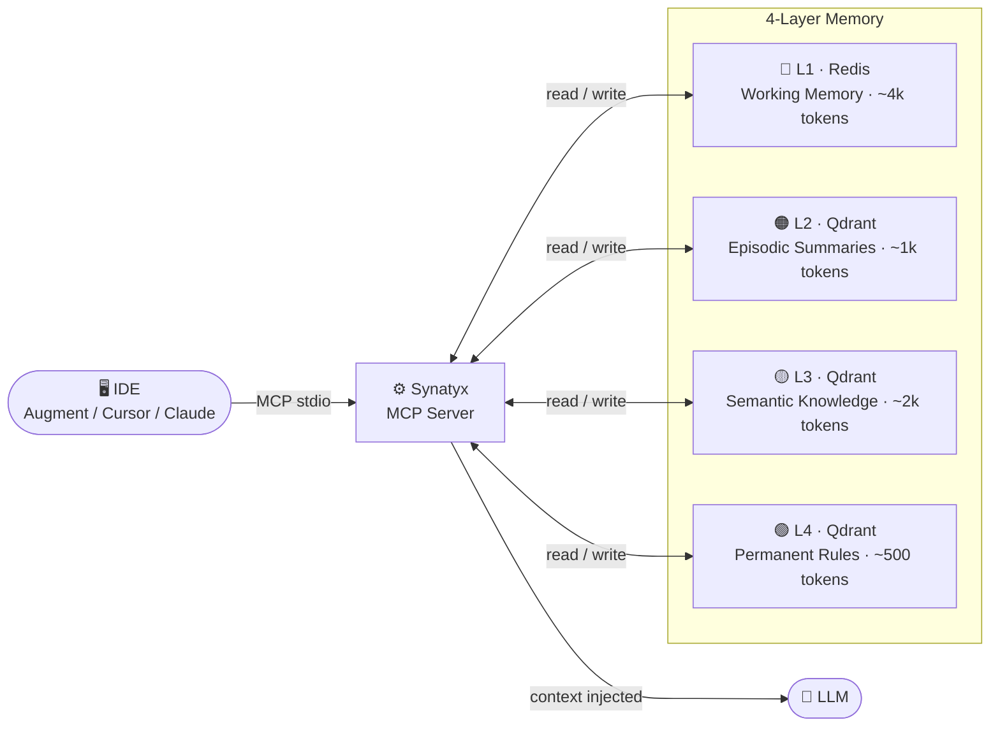
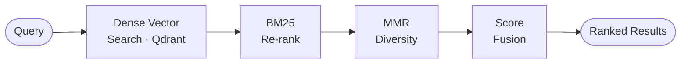

<div align="center">

# Synatyx

**A production-ready Context Engine for LLMs.**
Persistent, structured, relevance-scored memory — across every conversation.

[](https://python.org)
[](LICENSE)
[](docs/local-setup.md)
[](docker-compose.yml)

</div>

---

## The Problem

LLMs forget everything between conversations. Every new session starts from zero — no memory of past decisions, preferences, or context. Synatyx solves this.

## How It Works



## Retrieval Pipeline



---

## Features

- **11 MCP Tools** — store, retrieve, summarize, score, checkpoint, deprecate, list, ingest, task management
- **4-Layer Memory** — Redis L1 + Qdrant L2–L4 + Postgres sessions, tasks, audit log
- **Parser System** — ingest `.docx`, `.pdf`, `.md`, source code (`.py`, `.ts`, `.go`, `.rs`, …), any URL
- **Checkpoint System** — named pinned snapshots with soft deprecation, never deleted
- **Task Mechanism** — persistent cross-session task tracking with priority and status
- **Hybrid Retrieval** — dense + BM25 sparse + MMR diversity fused into one ranked list
- **Token Budget Manager** — auto-allocates context per layer, respects model limits
- **Production Ready** — Dockerfile, Docker Compose, Alembic migrations, health checks

---

## MCP Tools

| Category | Tool | What it does |
|---|---|---|
| **Memory** | `context_store` | Save a fact, decision, or note |
| | `context_retrieve` | Hybrid semantic search across all layers |
| | `context_summarize` | Compress L1 → L2 episodic vector via LLM |
| | `context_score` | Re-rank a list of items against a query |
| **Knowledge** | `context_checkpoint` | Named pinned snapshot — importance = 1.0 |
| | `context_deprecate` | Mark superseded items — never deleted |
| | `context_list` | Browse stored items without vector search |
| | `context_ingest` | Parse any file or URL → auto-chunk → store |
| **Tasks** | `context_task_add` | Add a task to remember for later |
| | `context_task_list` | List tasks by status, priority, project |
| | `context_task_update` | Update status, priority, or description |

---

## Tech Stack

| Component | Technology |
|---|---|
| Core | Python 3.12 + asyncio |
| MCP Transport | Anthropic MCP SDK — JSON-RPC 2.0 / stdio |
| GraphQL | Strawberry — async-first, type-safe |
| Vector DB | Qdrant |
| Working Memory | Redis |
| Metadata + Tasks | PostgreSQL + Alembic |
| Embeddings + LLM | OpenAI `text-embedding-3-small` + `gpt-4o-mini` |

---

## Quick Start

→ **[Full Local Setup Guide](docs/local-setup.md)**

```bash
git clone https://github.com/tanerincode/synatyx.git && cd synatyx
cp .env.example .env          # set EMBEDDING_OPENAI_API_KEY
docker compose up -d qdrant redis postgres
uv sync && alembic upgrade head
python main.py
```

---

## Project Structure

```
synatyx/
├── src/
│   ├── core/          # retrieve, store, summarize, score, ingest, budget
│   ├── parsers/       # docx, pdf, markdown, code, web + registry
│   ├── transports/
│   │   ├── mcp/       # MCP stdio server, tools.json, adapters
│   │   └── graphql/   # Strawberry schema, resolvers, subscriptions
│   ├── storage/       # Qdrant, Redis, PostgreSQL clients
│   └── models/        # context, session, task, memory layer
├── docs/
│   └── local-setup.md
├── alembic/           # database migrations
├── Dockerfile
├── docker-compose.yml
└── pyproject.toml
```

---

## License

MIT © [Taner Tombas](https://github.com/tanerincode)

