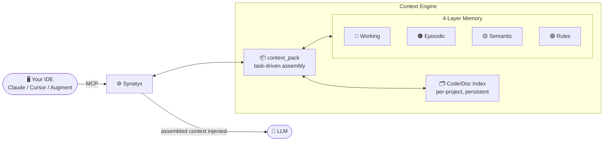

<div align="center">

# Synatyx

**The context engine your AI agents have been missing.**

Not just memory — assembled context. Synatyx stores what your agent learns, indexes what it works on, and hands back exactly the context the current task needs, in one call, within a token budget.

[](https://python.org)
[](LICENSE)
[](docs/mcp-tools.md)
[](docker-compose.yml)

</div>

---

## The Problem

LLMs are stateless. Every new conversation starts from zero — no memory of past decisions, preferences, or project context. And even with a memory store bolted on, the agent has to *remember to ask*, stitch results together itself, and hope the right facts surface.

**Synatyx fixes both halves**: it persists context across sessions, and it assembles it back for you.

---

## What It Does

Synatyx is a **Context Engine** that plugs into any MCP-compatible AI client (Claude Code, Cursor, Claude Desktop, Augment Code) over streamable-HTTP or stdio.


```mermaid
flowchart LR
    IDE(["🖥️ Your IDE\nClaude / Cursor / Augment"])
    MCP["⚙️ Synatyx"]
    LLM(["🤖 LLM"])

    IDE -->|MCP| MCP
    MCP -->|assembled context injected| LLM

    subgraph Engine ["Context Engine"]
        PACK["📦 context_pack\ntask-driven assembly"]
        IDX["🗂️ Code/Doc Index\nper-project, persistent"]
        subgraph Memory ["4-Layer Memory"]
            L1["🔴 Working"]
            L2["🟠 Episodic"]
            L3["🟡 Semantic"]
            L4["🟢 Rules"]
        end
    end

    MCP <--> PACK
    PACK <--> Memory
    PACK <--> IDX
```

Your AI **remembers** what you decided last week, **finds** the exact function you're asking about, and **starts every task with the right context already assembled**.

---

## Why Synatyx

**📦 One-call context assembly**
`context_pack` takes the task you're about to do and returns a single prompt-ready block: relevant memories with their relations, pinned decisions, dead ends to avoid, open tasks, matching skills, and code hits — token-budgeted, with unspent budget reallocated to the fullest sections. → [docs](docs/context-pack.md)

**🗂️ Persistent code & doc index**
Per-project, idempotent, `.gitignore`-aware indexing into a dedicated collection. Hybrid search fuses dense vectors with exact-symbol and full-text passes, so `get_storage_for` is findable even when embeddings miss it. → [docs](docs/code-index.md)

**🧠 Persistent memory across sessions**
4-layer model (working / episodic / semantic / procedural) with hybrid dense + BM25 + MMR retrieval. Empty results come back with diagnostics explaining why.

**📋 One-call session briefing**
`context_brief` composes identity, project knowledge, recent changes, failed attempts, and open tasks into a single token-budgeted digest.

**🔌 Proactive context**
MCP resources (`context://brief`) and prompts (`session-start`, `pack-context`) let clients inject context without any tool-call discipline.

**📦 Multi-project isolation**
Each project gets its own memory space (`ctx_<slug>`) and its own index (`ctx_<slug>__index`). Nothing bleeds over.

**🪝 Automatic session capture**
Server-side session tracking turns memory traffic into L2 traces with zero client setup — plus a SessionEnd hook that posts conversation digests to `/capture`.

**🧹 Self-maintaining memory**
File-hash staleness detection, type-aware TTL decay, background consolidation, and an observer that auto-links related memories.

**🔖 Checkpoints, tasks, skills**
Pin decisions as named snapshots, track tasks across sessions, RAG-search agent skill definitions.

**🏭 Production-ready**
Streamable-HTTP transport (stateless — deploys don't strand clients), Docker Compose, Alembic migrations, health checks, admin dashboard.

---

## Works With

| Client | Integration |
|--------|------------|
| **Claude Code** | streamable-HTTP / stdio |
| **Cursor** | streamable-HTTP / stdio |
| **Claude Desktop** | streamable-HTTP / stdio |
| **Augment Code** | streamable-HTTP / stdio |
| Any MCP client | JSON-RPC 2.0 |

---

## Get Started

```bash
git clone https://github.com/tanerincode/synatyx.git && cd synatyx
cp .env.example .env   # add your EMBEDDING_OPENAI_API_KEY
make                   # starts everything + tails logs
```

→ **[Full Setup Guide](docs/local-setup.md)**

---

## Connecting Clients

A remote Synatyx server accepts **either** the static admin key **or** an OAuth 2.1
access token it issues itself. Set these in `.env` before you start:

```bash
AUTH_ADMIN_KEY=<a long random string>     # also the owner secret on the login page
PUBLIC_URL=https://memory.example.com     # the URL clients type; https unless localhost
OAUTH_ENABLED=true                        # default
```

### Connecting from claude.ai

claude.ai cannot send custom headers, so it uses the OAuth flow (dynamic client
registration + PKCE — no client IDs to copy anywhere).

1. Settings → **Connectors** → *Add custom connector*.
2. URL: `https://memory.example.com/mcp` (your `PUBLIC_URL` + `/mcp`). Leave the
   advanced OAuth fields empty — discovery handles them.
3. Click **Connect**. Synatyx shows a single-field page: enter your
   `AUTH_ADMIN_KEY` (or `OAUTH_OWNER_PASSWORD`, if you set one) and confirm.
4. The connector turns green and all tools appear. The token lasts an hour and
   refreshes silently; re-authorizing only happens if you revoke or rotate keys.

### Connecting from Claude Code

Claude Code can send a header, which is the simplest path:

```bash
claude mcp add --transport http synatyx https://memory.example.com/mcp \
  --header "X-Auth-Key: $AUTH_ADMIN_KEY"
```

It also supports OAuth — add it without a header and run `/mcp` in Claude Code,
then pick *Authenticate*; the same login page opens in your browser:

```bash
claude mcp add --transport http synatyx https://memory.example.com/mcp
```

Behind a reverse proxy, set `FORWARDED_ALLOW_IPS` in `.env` to the proxy's address as
the container sees it (uvicorn reads it; `"*"` is acceptable only when the app port is
not published to the internet, which holds in `docker-compose.yml` where `synatyx-mcp`
publishes no ports). Without it every caller shares one OAuth login throttle bucket, so
ten wrong guesses from anyone lock the owner's own login out for a minute.

Both paths hit the same `/mcp` endpoint. For local development
(`PUBLIC_URL=http://localhost:9000`) plain HTTP is allowed; in production the
issuer must be HTTPS or OAuth stays off and only the admin key works.

---

## Documentation

| Doc | What's inside |
|-----|--------------|
| [Local Setup](docs/local-setup.md) | Prerequisites, Docker, IDE config, Makefile reference, troubleshooting |
| [MCP Tools Reference](docs/mcp-tools.md) | All 31 tools — generated from `tools.json` |
| [Context Pack](docs/context-pack.md) | Task-driven context assembly — sections, budgeting, rendered output |
| [Code & Doc Index](docs/code-index.md) | Persistent per-project indexing + hybrid exact-symbol search |
| [Architecture](docs/architecture.md) | 4-layer memory model, retrieval pipeline, tech stack, project structure |
| [Memory Relations](docs/memory-relations.md) | Typed edges between memories — supersedes chains, retrieval expansion |
| [Memory Visualization](docs/memory-visualization.md) | `context_visualize` — Mermaid memory graphs |
| [Session Brief & Trust](docs/session-brief.md) | `context_brief`, retrieval diagnostics, provenance, attempt records |
| [Automatic Capture](docs/automatic-capture.md) | Zero-setup session tracking + `/capture` endpoint + SessionEnd hook |
| [Memory Hygiene](docs/memory-hygiene.md) | Staleness flags, type-aware TTL decay, background consolidation |
| [Alternative Detection](docs/alternatives.md) | Auto-detecting memories that serve the same purpose |
| [Efficiency Improvements](docs/efficiency-improvements.md) | Batch store, direct get, parallel retrieval |

---

## License

MIT © [Taner Tombas](https://github.com/tanerincode)
