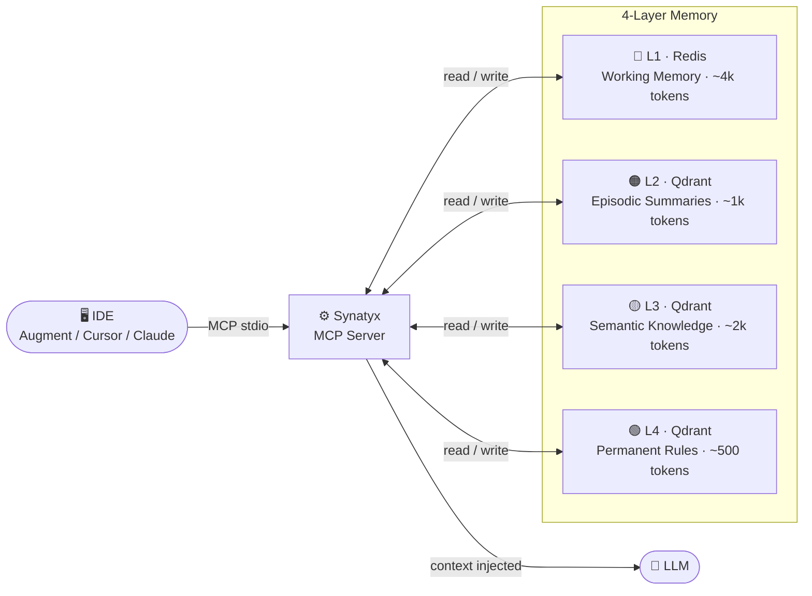
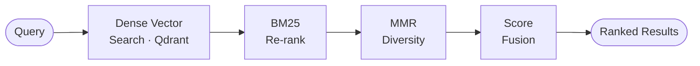

# Synatyx — Architecture

## How It Works



---

## 4-Layer Memory Model

| Layer | Storage | Purpose | Token Budget |
|-------|---------|---------|--------------|
| **L1** | Redis | Working memory — ephemeral facts for the current session | ~4k |
| **L2** | Qdrant | Episodic — compressed summaries of past sessions | ~1k |
| **L3** | Qdrant | Semantic knowledge — stable facts, decisions, checkpoints, skills | ~2k |
| **L4** | Qdrant (`ctx_users`) | Procedural — user-global rules, preferences, coding style | ~500 |

> L4 is always stored in the shared `ctx_users` collection — it follows the user across all projects.

---

## Retrieval Pipeline



1. **Dense vector search** — embed query, cosine similarity against Qdrant collection
2. **BM25 re-rank** — sparse keyword boost for exact term matches
3. **MMR diversity** — reduce redundancy across results
4. **Score fusion** — combine semantic + recency + importance + user signal scores

---

## Tech Stack

| Component | Technology |
|-----------|-----------|
| Core | Python 3.12 + asyncio |
| MCP Transport | Anthropic MCP SDK — JSON-RPC 2.0 / stdio |
| Vector DB | Qdrant |
| Working Memory | Redis |
| Metadata + Tasks | PostgreSQL + Alembic |
| Embeddings | OpenAI `text-embedding-3-small` or `sentence-transformers` |
| LLM (summarize) | `gpt-4o-mini` |

---

## Project Structure

```
synatyx/
├── src/
│   ├── core/          # retrieve, store, summarize, score, ingest, skill, budget, project
│   ├── parsers/       # docx, pdf, markdown, code, web + registry
│   ├── transports/
│   │   └── mcp/       # MCP stdio server, tools.json, adapters
│   ├── storage/       # Qdrant, Redis, PostgreSQL clients
│   └── models/        # context, session, task, skill, memory layer
├── .claude/
│   ├── CLAUDE.md      # Claude Code rules
│   └── skills/        # Claude Agent Skills
├── .cursor/rules/     # Cursor rules
├── .augment/rules/    # Augment rules
├── docs/              # Documentation
├── alembic/           # Database migrations
├── Makefile
├── Dockerfile
├── docker-compose.yml
└── pyproject.toml
```

---

## Multi-Project Isolation

Each project gets its own dedicated Qdrant collection (`ctx_<slug>`). The active project is persisted per user in Redis and survives server restarts.

```
context_set_project(project="my-app")
→ all memory ops route to ctx_my_app
→ context_retrieve returns only my-app memories
```

L4 (user preferences) is always global — stored in `ctx_users` regardless of active project.

